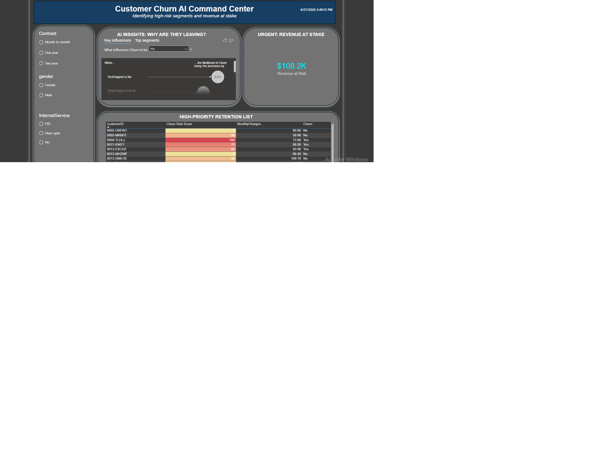

# 🚀 AI-Powered Customer Churn Command Center

## 📊 Business Problem
A telecommunications company is losing revenue due to customer attrition. This project moves from **Descriptive Analytics** (what happened) to **Predictive Analytics** (what will happen) by identifying high-risk customers before they churn.

## 🖼️ Dashboard Preview

## 🛠️ Technical Highlights
* **Data Engineering:** Cleaned and transformed 7,000+ records using Power Query, handling missing values and data type logic.
* **AI Driver Analysis:** Leveraged Power BI's Machine Learning engine to identify that "Fiber Optic" customers without "Tech Support" are **3.5x** more likely to leave.
* **Predictive Modeling:** Created a custom **weighted Risk Score (0-100)** using DAX to prioritize the sales team's outreach.
* **Financial Impact:** Quantified **$108,190 in Monthly Recurring Revenue (MRR)** currently sitting in high-risk segments.

## 📂 Project Files
* `Customer-Churn-Al-Dashboard.pbix`: The interactive Power BI report.
* `WA_Fn-UseC_-Telco-Customer-Churn.csv`: The dataset used for this analysis.
